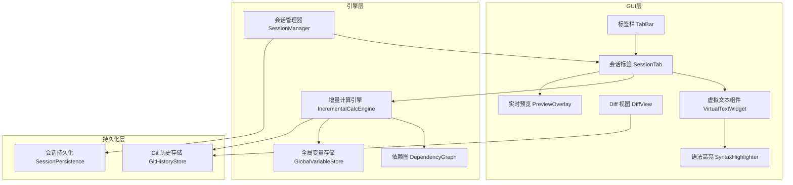

# 设计文档：CalcPaper 增强功能

## 概述

本设计文档描述 CalcPaper 计算稿纸应用的三大增强方向：

1. **Git 历史系统**（需求 1-3）：使用 Git 仓库持久化计算历史，支持 diff 风格展示和版本回溯
2. **多会话标签页**（需求 4-6）：支持多标签页独立计算上下文，全局变量共享，以及会话持久化
3. **性能与 UI 优化**（需求 7-11）：虚拟化文本渲染、增量计算引擎、语法高亮优化、实时预览、自动输出格式检测

设计目标是在保持现有架构（Python + Tkinter/CustomTkinter）的基础上，通过模块化扩展实现上述功能，确保向后兼容。

## 架构

### 高层架构图



### 模块划分

| 模块文件 | 职责 |
|---------|------|
| `calc_paper.py` | 核心计算引擎（现有），新增自动格式检测逻辑 |
| `calc_paper_gui.py` | GUI 主框架（现有），重构为多标签页架构 |
| `calc_history.py` | **新增** Git 历史存储模块 |
| `calc_session.py` | **新增** 多会话管理与持久化模块 |
| `calc_incremental.py` | **新增** 增量计算引擎与依赖图 |
| `calc_virtual_text.py` | **新增** 虚拟化文本渲染组件 |
| `calc_syntax.py` | **新增** 增量语法高亮引擎 |

## 组件与接口

### 1. GitHistoryStore（Git 历史存储）

```python
class GitHistoryStore:
    """基于 Git 的计算历史存储"""
    
    def __init__(self, repo_path: str = "~/.calcpaper/history"):
        """初始化或打开 Git 仓库"""
        
    def is_available(self) -> bool:
        """检查 Git 是否可用"""
        
    def commit(self, session_id: str, input_text: str, output_text: str, message: str = None) -> str | None:
        """提交一次计算快照，返回 commit hash 或 None（内容未变化时）"""
        
    def get_history(self, session_id: str, limit: int = 100) -> list[HistoryEntry]:
        """获取指定会话的历史记录列表（时间倒序）"""
        
    def get_diff(self, commit_hash: str) -> DiffResult:
        """获取指定提交相对于父提交的 diff"""
        
    def restore(self, commit_hash: str) -> tuple[str, str]:
        """恢复指定提交的内容，返回 (input_text, output_text)"""
        
    def has_changes(self, session_id: str, input_text: str, output_text: str) -> bool:
        """检查内容是否与最近一次提交不同"""
```

### 2. SessionManager（会话管理器）

```python
class SessionManager:
    """管理多个计算会话"""
    
    def __init__(self, global_store: GlobalVariableStore):
        """初始化会话管理器"""
        
    def create_session(self, name: str = None) -> Session:
        """创建新会话"""
        
    def close_session(self, session_id: str) -> None:
        """关闭并释放会话资源"""
        
    def get_session(self, session_id: str) -> Session:
        """获取指定会话"""
        
    def list_sessions(self) -> list[Session]:
        """列出所有活跃会话"""
        
    def save_all(self, filepath: str) -> None:
        """持久化所有会话状态"""
        
    def load_all(self, filepath: str) -> None:
        """从文件恢复所有会话"""
```

### 3. GlobalVariableStore（全局变量存储）

```python
class GlobalVariableStore:
    """跨会话共享的全局变量存储"""
    
    def __init__(self):
        self._variables: dict[str, any] = {}
        self._listeners: list[Callable] = []
        
    def set(self, name: str, value) -> None:
        """设置全局变量并通知所有监听者"""
        
    def get(self, name: str, default=None):
        """获取全局变量值"""
        
    def has(self, name: str) -> bool:
        """检查全局变量是否存在"""
        
    def subscribe(self, callback: Callable) -> None:
        """注册变量变更监听器"""
        
    def get_all(self) -> dict[str, any]:
        """获取所有全局变量"""
```

### 4. IncrementalCalcEngine（增量计算引擎）

```python
class IncrementalCalcEngine:
    """支持增量计算的引擎包装器"""
    
    def __init__(self, calculator: CalculatorPaperAdvanced, global_store: GlobalVariableStore):
        """包装现有计算引擎，添加增量计算能力"""
        
    def process_full(self, text: str) -> list[LineResult]:
        """全量计算并建立依赖图"""
        
    def process_incremental(self, old_text: str, new_text: str, changed_lines: list[int]) -> list[LineResult]:
        """增量计算：仅重算变化行及其依赖行"""
        
    def get_dependencies(self, line_index: int) -> set[int]:
        """获取指定行依赖的所有行号"""
        
    def get_dependents(self, line_index: int) -> set[int]:
        """获取依赖于指定行的所有行号"""
        
    def preview_line(self, line_text: str) -> LineResult | None:
        """预览单行计算结果（不修改状态）"""
```

### 5. VirtualTextWidget（虚拟化文本组件）

```python
class VirtualTextWidget(ctk.CTkFrame):
    """虚拟化渲染的文本组件，仅渲染可视区域"""
    
    def __init__(self, parent, **kwargs):
        """初始化虚拟文本组件"""
        
    def set_content(self, lines: list[str]) -> None:
        """设置全部内容（不立即渲染）"""
        
    def get_content(self) -> str:
        """获取全部文本内容"""
        
    def get_visible_range(self) -> tuple[int, int]:
        """获取当前可视行范围 (start_line, end_line)"""
        
    def scroll_to_line(self, line_index: int) -> None:
        """滚动到指定行"""
        
    def render_visible(self) -> None:
        """渲染可视区域内容"""
        
    def insert(self, index: str, text: str) -> None:
        """兼容 Tkinter Text 的插入接口"""
        
    def delete(self, start: str, end: str) -> None:
        """兼容 Tkinter Text 的删除接口"""
        
    def get(self, start: str, end: str) -> str:
        """兼容 Tkinter Text 的获取接口"""
```

### 6. SyntaxHighlighter（语法高亮器）

```python
class SyntaxHighlighter:
    """增量语法高亮引擎"""
    
    TOKEN_TYPES = ['comment', 'variable', 'number', 'operator', 'function', 'datetime', 'global_var', 'error', 'result', 'bitmap']
    
    def __init__(self, text_widget, theme: str = 'dark'):
        """初始化语法高亮器"""
        
    def highlight_full(self, text: str) -> None:
        """全量高亮"""
        
    def highlight_lines(self, line_indices: list[int]) -> None:
        """增量高亮指定行"""
        
    def set_theme(self, theme: str) -> None:
        """切换主题配色"""
        
    def tokenize_line(self, line: str) -> list[Token]:
        """将一行文本分词为 Token 列表"""
```

## 数据模型

### HistoryEntry（历史条目）

```python
@dataclass
class HistoryEntry:
    commit_hash: str          # Git commit SHA
    timestamp: datetime       # 提交时间
    message: str              # 提交消息（含变更摘要）
    session_id: str           # 所属会话 ID
```

### DiffResult（差异结果）

```python
@dataclass
class DiffLine:
    type: str                 # 'add', 'delete', 'context'
    content: str              # 行内容
    old_line_no: int | None   # 旧文件行号
    new_line_no: int | None   # 新文件行号

@dataclass
class DiffResult:
    commit_hash: str
    parent_hash: str | None
    lines: list[DiffLine]
```

### Session（会话）

```python
@dataclass
class Session:
    session_id: str           # UUID
    name: str                 # 显示名称
    input_text: str           # 输入内容
    output_text: str          # 输出内容
    variables: dict[str, any] # 局部变量
    calculator: CalculatorPaperAdvanced  # 计算引擎实例
    created_at: datetime      # 创建时间
```

### SessionFile（会话持久化格式）

```json
{
  "version": 2,
  "active_tab_index": 0,
  "global_variables": {
    "pi": 3.14159
  },
  "sessions": [
    {
      "session_id": "uuid-string",
      "name": "计算1",
      "input": "a = 100\nb = a * 2",
      "output": "a = 100  = 100\nb = a * 2  = 200",
      "variables": {"a": 100, "b": 200}
    }
  ]
}
```

### LineResult（行计算结果）

```python
@dataclass
class LineResult:
    line_index: int           # 行号
    input_line: str           # 输入行
    output_line: str          # 输出行（含结果）
    result_value: any         # 计算结果值
    variables_defined: list[str]   # 本行定义的变量
    variables_used: list[str]      # 本行引用的变量
    is_error: bool            # 是否计算错误
    error_message: str | None # 错误信息
```

### DependencyGraph（依赖图）

```python
class DependencyGraph:
    """行级别依赖关系图"""
    
    def __init__(self):
        self._defines: dict[int, set[str]] = {}    # 行号 -> 定义的变量集合
        self._uses: dict[int, set[str]] = {}       # 行号 -> 使用的变量集合
        self._var_to_line: dict[str, int] = {}     # 变量名 -> 定义行号
        
    def build(self, line_results: list[LineResult]) -> None:
        """从计算结果构建依赖图"""
        
    def get_affected_lines(self, changed_lines: list[int]) -> list[int]:
        """给定变化行，返回所有需要重算的行（含传递依赖），按行号排序"""
        
    def update_line(self, line_index: int, result: LineResult) -> None:
        """更新单行的依赖信息"""
```

### 自动格式检测逻辑（需求 11）

在现有 `CalculatorPaperAdvanced.parse_line` 方法中扩展：

```python
# 格式检测优先级：
# 1. 显式 hex() 函数 → 十六进制输出
# 2. 表达式含 0x 字面量 → 十六进制输出  
# 3. 表达式含 0b 字面量 → 二进制输出
# 4. 同时含 0x 和 0b → 十六进制输出
# 5. 无特殊字面量 → 十进制输出

class OutputFormat(Enum):
    DECIMAL = 'decimal'
    HEXADECIMAL = 'hex'
    BINARY = 'binary'

def detect_output_format(expression: str, has_explicit_hex_func: bool) -> OutputFormat:
    """根据表达式中的字面量自动检测输出格式"""
    if has_explicit_hex_func:
        return OutputFormat.HEXADECIMAL
    has_hex = bool(re.search(r'0[xX][0-9a-fA-F]+', expression))
    has_bin = bool(re.search(r'0[bB][01]+', expression))
    if has_hex:
        return OutputFormat.HEXADECIMAL
    if has_bin:
        return OutputFormat.BINARY
    return OutputFormat.DECIMAL
```


## 正确性属性

*属性（Property）是指在系统所有合法执行中都应成立的特征或行为——本质上是对系统应做之事的形式化陈述。属性是人类可读规格说明与机器可验证正确性保证之间的桥梁。*

### Property 1: 提交内容往返一致性

*For any* 输入文本和输出文本，将其通过 `commit()` 提交到 GitHistoryStore 后，使用 `restore()` 恢复该提交，返回的 (input_text, output_text) 应与原始内容完全相同。

**Validates: Requirements 2.1, 2.3, 3.4**

### Property 2: 提交消息格式正确性

*For any* 通过 GitHistoryStore 创建的提交，其提交消息应包含 ISO 格式时间戳和非空的变更摘要文本。

**Validates: Requirements 2.2**

### Property 3: 重复内容提交幂等性

*For any* 输入文本和输出文本，连续两次以相同内容调用 `commit()`，第二次调用应返回 None（跳过），且仓库中的提交总数不应增加。

**Validates: Requirements 2.4**

### Property 4: 历史记录时间倒序

*For any* 包含多次提交的 GitHistoryStore，调用 `get_history()` 返回的列表应按时间戳严格递减排序。

**Validates: Requirements 3.1**

### Property 5: 会话变量隔离性

*For any* 两个不同的 Session，在其中一个 Session 中定义的局部变量不应出现在另一个 Session 的变量字典中，且不应影响另一个 Session 的计算结果。

**Validates: Requirements 4.2, 4.3**

### Property 6: 标签切换状态保持

*For any* Session 的状态（输入文本、输出文本、变量），切换到另一个标签再切换回来后，该 Session 的完整状态应与切换前完全相同。

**Validates: Requirements 4.4**

### Property 7: 全局变量跨会话同步

*For any* 全局变量名和值，在一个 Session 中通过 `global()` 设置后，所有其他 Session 在引用该变量时应获得相同的值。

**Validates: Requirements 5.1, 5.2, 5.3**

### Property 8: 局部变量优先于全局变量

*For any* 变量名同时存在于全局存储和某个 Session 的局部变量中时，该 Session 的计算应使用局部变量的值。

**Validates: Requirements 5.5**

### Property 9: 多会话持久化往返一致性

*For any* SessionManager 状态（包含多个 Session 的名称、输入、输出、变量，以及全局变量），调用 `save_all()` 后再 `load_all()`，恢复的所有 Session 数据和全局变量应与保存前完全相同。

**Validates: Requirements 6.1, 6.2, 6.3, 6.4**

### Property 10: 虚拟文本可视范围正确性

*For any* 内容长度和滚动位置，VirtualTextWidget 的 `get_visible_range()` 返回的行范围应满足：start >= 0，end <= 总行数，且 end - start <= 可视区域容纳的最大行数。

**Validates: Requirements 7.1**

### Property 11: 虚拟文本光标往返一致性

*For any* 合法的光标位置，通过 API 设置光标位置后再读取，应返回相同的位置值。

**Validates: Requirements 7.4**

### Property 12: 增量计算等价于全量计算

*For any* 文本修改操作（旧文本 → 新文本），增量计算 `process_incremental()` 的结果应与对新文本执行 `process_full()` 的结果完全相同。

**Validates: Requirements 8.1, 8.2**

### Property 13: 依赖图正确性

*For any* 一组计算行，若行 A 定义了变量 X 且行 B 使用了变量 X（A < B），则 `get_affected_lines([A])` 的结果应包含行 B。

**Validates: Requirements 8.3**

### Property 14: 语法分词正确性

*For any* 合法的 CalcPaper 输入行，`tokenize_line()` 产生的 Token 列表拼接后应等于原始行文本，且每个 Token 的类型应属于已定义的 TOKEN_TYPES 集合。

**Validates: Requirements 9.1, 9.2, 9.4**

### Property 15: 增量高亮等价于全量高亮

*For any* 文本修改操作，对变化行执行 `highlight_lines()` 后的高亮状态应与对全文执行 `highlight_full()` 的结果相同。

**Validates: Requirements 9.3**

### Property 16: 无效表达式预览返回空

*For any* 语法不完整或包含错误的表达式字符串，`preview_line()` 应返回 None。

**Validates: Requirements 10.3**

### Property 17: 预览结果与正式计算一致

*For any* 合法的完整表达式，`preview_line()` 返回的结果值应与通过 `parse_line()` 正式计算得到的结果值相同。

**Validates: Requirements 10.4**

### Property 18: 输出格式自动检测

*For any* 表达式，`detect_output_format()` 应满足以下规则：
- 若使用了显式 `hex()` 函数 → 返回 HEXADECIMAL
- 若含 0x 字面量（无显式 hex()）→ 返回 HEXADECIMAL
- 若仅含 0b 字面量 → 返回 BINARY
- 若不含任何 hex/bin 字面量 → 返回 DECIMAL

**Validates: Requirements 11.1, 11.2, 11.3, 11.4, 11.5**

## 错误处理

### Git 相关错误

| 场景 | 处理策略 |
|------|---------|
| Git 未安装 | 回退到内存历史模式，状态栏显示 "⚠ Git 不可用，历史记录仅保存在内存中" |
| 仓库损坏 | 尝试 `git fsck --repair`，失败则重新初始化空仓库 |
| 提交失败 | 静默忽略，不中断用户操作，记录到日志 |
| diff 解析失败 | 显示原始文本而非 diff 视图 |

### 会话相关错误

| 场景 | 处理策略 |
|------|---------|
| 会话文件损坏 | 创建新的空白会话，备份损坏文件为 `.bak` |
| 全局变量类型不兼容 | 跳过该变量的同步，在变量面板标记警告 |
| 会话 ID 冲突 | 生成新 UUID 替代 |

### 计算引擎错误

| 场景 | 处理策略 |
|------|---------|
| 增量计算结果与全量不一致 | 自动回退到全量计算 |
| 依赖图循环引用 | 检测到循环时标记错误行，中断传播 |
| 预览计算超时（>100ms） | 取消预览，不显示结果 |

### 渲染错误

| 场景 | 处理策略 |
|------|---------|
| 虚拟文本渲染异常 | 回退到标准 Tkinter Text 组件 |
| 语法高亮正则超时 | 跳过该行高亮，保持纯文本显示 |

## 测试策略

### 双重测试方法

本项目采用单元测试与属性测试相结合的策略：

- **单元测试**：验证具体示例、边界情况和错误条件
- **属性测试**：验证跨所有输入的通用属性

两者互补，共同提供全面的覆盖。

### 属性测试配置

- **测试库**：[Hypothesis](https://hypothesis.readthedocs.io/)（Python 属性测试标准库）
- **最小迭代次数**：每个属性测试至少 100 次迭代
- **标签格式**：`Feature: calcpaper-enhancements, Property {number}: {property_text}`
- **每个正确性属性对应一个属性测试函数**

### 测试分层

| 层级 | 测试类型 | 覆盖范围 |
|------|---------|---------|
| 引擎层 | 属性测试 + 单元测试 | 格式检测、增量计算、依赖图、全局变量 |
| 持久化层 | 属性测试 + 集成测试 | Git 历史往返、会话序列化往返 |
| GUI 层 | 单元测试 | 语法分词、虚拟文本范围计算 |
| 端到端 | 手动测试 | 标签切换、快捷键、视觉效果 |

### 单元测试重点

- Git 不可用时的回退行为（需求 1.4）
- 关闭最后一个标签页时自动创建新标签（需求 4.6）
- 历史记录 diff 视图的具体示例（需求 3.2）
- 空仓库首次提交的边界情况
- 十六进制和二进制同时存在时的优先级（需求 11.3）

### 属性测试重点

- 所有往返一致性属性（Property 1, 9, 11）
- 幂等性属性（Property 3）
- 等价性属性（Property 12, 15, 17）
- 格式检测规则（Property 18）
- 隔离性和同步属性（Property 5, 7, 8）

### 测试文件结构

```
tests/
├── test_history_store.py      # Git 历史存储测试（Property 1-4）
├── test_session_manager.py    # 会话管理测试（Property 5-6, 9）
├── test_global_variables.py   # 全局变量测试（Property 7-8）
├── test_virtual_text.py       # 虚拟文本测试（Property 10-11）
├── test_incremental_calc.py   # 增量计算测试（Property 12-13）
├── test_syntax.py             # 语法高亮测试（Property 14-15）
├── test_preview.py            # 实时预览测试（Property 16-17）
└── test_format_detection.py   # 格式检测测试（Property 18）
```
