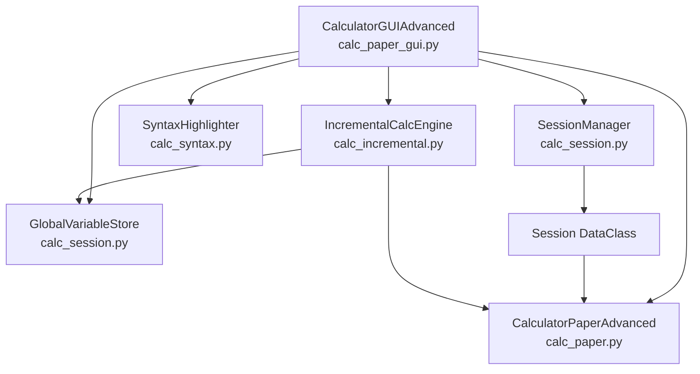
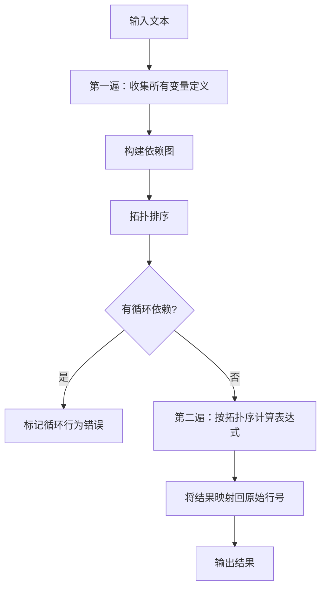

# 设计文档：CalcPaper 标签页增强

## 概述

本设计文档描述 CalcPaper 多标签页计算器的三项核心增强功能的技术实现方案：

1. **局部变量前向引用** — 变量在标签页内任意位置定义后，所有行（包括定义行之前的行）都能引用，通过拓扑排序解决依赖关系
2. **注释语法支持** — 支持 `#` 整行注释和行内注释，计算引擎正确跳过注释内容
3. **撤销/恢复历史标签页隔离** — 每个标签页维护独立的撤销/恢复历史栈

这三项功能共同提升多标签页场景下的数据隔离性和用户体验。

## 架构

### 现有架构概览



### 改动影响分析

| 功能 | 影响模块 | 改动类型 |
|------|----------|----------|
| 局部变量前向引用 | `calc_paper.py`, `calc_incremental.py` | **核心改动** — 需要拓扑排序算法 |
| 注释语法 | `calc_paper.py`, `calc_syntax.py` | 行为确认（现有设计已支持） |
| 撤销/恢复隔离 | `calc_paper_gui.py`, `calc_session.py` | **核心改动** |

### 关键发现

经过代码研究，发现：

1. **局部变量前向引用需要核心改动**：当前 `process_text()` 方法逐行顺序调用 `parse_line()`，变量只能在赋值行之后使用。要支持前向引用（如 `a = b * 3` 在 `b = 1` 之前），需要改为：先收集所有变量定义，构建依赖图，拓扑排序后按依赖顺序计算。

2. **注释语法已实现**：`parse_line()` 方法开头已处理 `#` 开头的注释行（返回 `None`），行内注释通过 `line.split('#')[0]` 处理。`SyntaxHighlighter` 已有注释高亮逻辑。

3. **撤销/恢复历史未隔离**：当前 `gui_history` 和 `gui_history_index` 是 `CalculatorGUIAdvanced` 类的实例属性，所有标签页共享同一个历史栈。

## 组件与接口

### 改动方案 1：前向引用 — 拓扑排序计算引擎

#### 问题分析

当前 `process_text()` 逐行顺序执行：
```
Line 0: a = b * 3   → 错误：b 未定义
Line 1: b = 1       → b = 1
```

期望行为：
```
Line 0: a = b * 3   → a = 3（因为 b 在 Line 1 定义为 1）
Line 1: b = 1       → b = 1
```

#### 算法设计：两遍扫描 + 拓扑排序



**第一遍扫描（收集阶段）：**
1. 遍历所有行，识别每行定义的变量名（赋值语句左侧）
2. 识别每行引用的变量名（表达式中的标识符）
3. 跳过注释行和空行

**构建依赖图：**
- 节点 = 每个赋值行
- 边 = 如果行 A 的表达式引用了行 B 定义的变量，则 A 依赖 B（A → B）
- 非赋值行（纯表达式行）依赖其引用的所有变量的定义行

**拓扑排序：**
- 使用 Kahn 算法（BFS）进行拓扑排序
- 如果排序后仍有未处理的节点，说明存在循环依赖

**第二遍扫描（计算阶段）：**
- 按拓扑序依次计算每行
- 计算完成后，将结果按原始行号重新排列输出

#### 接口变更

**`calc_paper.py` - CalculatorPaperAdvanced 新增方法：**

```python
class CalculatorPaperAdvanced:
    def process_text(self, text, preset_variables=None, preset_functions=None):
        """Process multi-line text with forward reference support.
        
        Uses topological sort to resolve variable dependencies,
        allowing variables defined on later lines to be referenced
        by earlier lines.
        """
        self.lines = []
        self.results = []
        self.variables = dict(preset_variables) if preset_variables else {}
        self.functions = dict(preset_functions) if preset_functions else {}

        lines = text.strip().split('\n')
        
        # Phase 1: Collect all definitions and build dependency graph
        line_infos = self._collect_definitions(lines)
        
        # Phase 2: Topological sort
        eval_order, circular_lines = self._topological_sort(line_infos)
        
        # Phase 3: Evaluate in dependency order
        self._evaluate_in_order(lines, line_infos, eval_order, circular_lines)
        
        self.save_state()

    def _collect_definitions(self, lines: list[str]) -> list[dict]:
        """第一遍扫描：收集每行的变量定义和引用信息。
        
        Returns:
            List of dicts with keys:
            - 'defines': str or None (variable name defined)
            - 'uses': set[str] (variable names referenced)
            - 'is_comment': bool
            - 'is_empty': bool
            - 'is_func_def': bool
        """
        ...

    def _topological_sort(self, line_infos: list[dict]) -> tuple[list[int], set[int]]:
        """对赋值行进行拓扑排序。
        
        Args:
            line_infos: 第一遍扫描的结果
            
        Returns:
            (eval_order, circular_lines):
            - eval_order: 按依赖顺序排列的行索引列表
            - circular_lines: 存在循环依赖的行索引集合
        """
        ...

    def _evaluate_in_order(self, lines, line_infos, eval_order, circular_lines):
        """按拓扑序计算表达式，将结果存入 self.results。
        
        对于 circular_lines 中的行，生成"循环依赖"错误。
        """
        ...
```

**`calc_incremental.py` - DependencyGraph 改动：**

`DependencyGraph.get_affected_lines()` 需要移除 `line_idx > current_line` 的限制，因为前向引用意味着依赖行可能在定义行之前：

```python
def get_affected_lines(self, changed_lines: list[int]) -> list[int]:
    affected = set(changed_lines)
    queue = list(changed_lines)
    while queue:
        current_line = queue.pop(0)
        defined_vars = self._defines.get(current_line, set())
        if not defined_vars:
            continue
        for line_idx, used_vars in self._uses.items():
            if line_idx not in affected:  # 移除 line_idx > current_line 限制
                if used_vars & defined_vars:
                    affected.add(line_idx)
                    queue.append(line_idx)
    return sorted(affected)
```

#### 循环依赖检测示例

```
输入：
  a = b + 1
  b = a + 1

依赖图：
  Line 0 (defines a) → depends on b (Line 1)
  Line 1 (defines b) → depends on a (Line 0)

拓扑排序结果：
  circular_lines = {0, 1}

输出：
  Line 0: 错误: 循环依赖 (a → b → a)
  Line 1: 错误: 循环依赖 (b → a → b)
```

#### 非赋值行（纯表达式行）的处理

纯表达式行（如 `b * 3`）不定义变量，但引用变量。它们的计算顺序取决于其引用的变量何时可用：
- 在拓扑排序中，纯表达式行作为"叶子节点"，依赖其引用的所有变量定义行
- 所有被依赖的变量计算完成后，纯表达式行才能计算

### 改动方案 2：撤销/恢复历史按标签页隔离

#### 方案设计

将 `gui_history` 和 `gui_history_index` 从 GUI 类级别移至 `Session` 数据类级别，每个 Session 维护独立的历史栈。

#### 接口变更

**`calc_session.py` - Session 数据类扩展：**

```python
@dataclass
class Session:
    session_id: str
    name: str
    input_text: str = ""
    output_text: str = ""
    variables: dict = field(default_factory=dict)
    calculator: CalculatorPaperAdvanced = field(default_factory=CalculatorPaperAdvanced)
    created_at: datetime = field(default_factory=datetime.now)
    # 新增：独立的撤销/恢复历史
    gui_history: list = field(default_factory=list)
    gui_history_index: int = -1
```

**`calc_paper_gui.py` - CalculatorGUIAdvanced 改动：**

```python
class CalculatorGUIAdvanced:
    def save_gui_state(self, input_text, output_text):
        """保存状态到当前标签页的历史栈"""
        session = self.session_manager.get_session(self._current_session_id)
        if session.gui_history_index < len(session.gui_history) - 1:
            session.gui_history = session.gui_history[:session.gui_history_index + 1]
        session.gui_history.append((input_text, output_text))
        session.gui_history_index = len(session.gui_history) - 1
        if len(session.gui_history) > 50:
            session.gui_history.pop(0)
            session.gui_history_index -= 1
        self.update_undo_redo_buttons()

    def undo(self):
        """从当前标签页的历史栈撤销"""
        session = self.session_manager.get_session(self._current_session_id)
        if session.gui_history_index > 0:
            session.gui_history_index -= 1
            inp, out = session.gui_history[session.gui_history_index]
            # ... 恢复 UI 内容 ...

    def redo(self):
        """从当前标签页的历史栈恢复"""
        session = self.session_manager.get_session(self._current_session_id)
        if session.gui_history_index < len(session.gui_history) - 1:
            session.gui_history_index += 1
            inp, out = session.gui_history[session.gui_history_index]
            # ... 恢复 UI 内容 ...
```

## 数据模型

### Session 数据模型（扩展后）

```python
@dataclass
class Session:
    session_id: str                    # UUID 唯一标识
    name: str                          # 显示名称
    input_text: str = ""               # 输入区文本
    output_text: str = ""              # 输出区文本
    variables: dict = field(...)       # 局部变量快照
    calculator: CalculatorPaperAdvanced  # 独立计算引擎
    created_at: datetime               # 创建时间
    gui_history: list = field(...)     # 撤销历史栈 [(input, output), ...]
    gui_history_index: int = -1        # 当前历史位置
```

### 变量依赖图模型

```
输入文本:
  Line 0: a = b * 3
  Line 1: b = c + 1
  Line 2: c = 10
  Line 3: result = a + b

依赖图 (邻接表):
  Line 0 → {Line 1}      (a depends on b)
  Line 1 → {Line 2}      (b depends on c)
  Line 2 → {}            (c has no dependencies)
  Line 3 → {Line 0, Line 1}  (result depends on a, b)

拓扑排序结果:
  [Line 2, Line 1, Line 0, Line 3]

计算顺序:
  1. c = 10        → c = 10
  2. b = c + 1     → b = 11
  3. a = b * 3     → a = 33
  4. result = a + b → result = 44

最终输出 (按原始行号):
  Line 0: a = b * 3     = 33
  Line 1: b = c + 1     = 11
  Line 2: c = 10        = 10
  Line 3: result = a + b = 44
```

### 变量作用域模型

```
┌─────────────────────────────────────────────┐
│           GlobalVariableStore               │
│  _variables: {name: value}                  │
│  _functions: {name: (params, body)}         │
│  通过 global() 声明，所有标签页可见          │
└─────────────────────────────────────────────┘
         │ 注入到每个 session.calculator
         ▼
┌──────────────────┐  ┌──────────────────┐
│   Session A      │  │   Session B      │
│ calculator:      │  │ calculator:      │
│   .variables = { │  │   .variables = { │
│     全局变量..., │  │     全局变量..., │
│     a = 33,     │  │     x = 20,     │
│     b = 11      │  │     y = 30      │
│   }             │  │   }             │
│ gui_history: [...] │  │ gui_history: [...] │
└──────────────────┘  └──────────────────┘
```

### 注释处理流程（已有，确认正确性）

```
输入行 → parse_line()
  ├─ 以 # 开头 → 返回 (None, None, None, None, False, None)
  ├─ 包含 # → line.split('#')[0] 取前半部分继续计算
  └─ 无 # → 正常计算
```


## 正确性属性

*属性（Property）是系统在所有有效执行中应保持为真的特征或行为——本质上是关于系统应该做什么的形式化陈述。属性是人类可读规范与机器可验证正确性保证之间的桥梁。*

### Property 1: 前向引用解析正确性

*For any* 有效的无环赋值集合（变量定义行的任意排列），无论行的物理顺序如何，计算引擎应正确解析所有变量引用并产生与按依赖顺序计算相同的结果。即：对于任意 DAG 形式的依赖关系，打乱行顺序后计算结果不变。

**Validates: Requirements 1.1**

### Property 2: 标签页间变量隔离

*For any* 两个不同的 Session 实例，在 Session A 中定义的局部变量不应出现在 Session B 的 `calculator.variables` 中（除非 Session B 自身也定义了同名变量），且 Session B 引用该变量时应产生"变量未定义"错误。

**Validates: Requirements 1.2, 1.3**

### Property 3: 全局变量跨标签页可用

*For any* 通过 `global()` 声明的变量，该变量应在所有 Session 的计算引擎中可用（通过 `GlobalVariableStore` 注入）。

**Validates: Requirements 1.4**

### Property 4: 局部变量优先于全局变量

*For any* 同时存在于 `GlobalVariableStore` 和当前 Session 的 `calculator.variables` 中的变量名，计算引擎在解析表达式时应使用当前 Session 的局部值。

**Validates: Requirements 1.5**

### Property 5: 依赖传播完整性

*For any* 变量赋值行及其依赖行链（包括前向和后向依赖），当赋值行的值改变后重新计算全文时，所有直接或间接依赖该变量的行应反映新的计算结果。

**Validates: Requirements 1.6**

### Property 6: 循环依赖检测

*For any* 包含循环依赖的赋值集合（如 `a = b + 1`, `b = a + 1`），计算引擎应检测到循环并对所有参与循环的行报告"循环依赖"错误，同时不影响非循环行的正常计算。

**Validates: Requirements 1.7**

### Property 7: 注释行不产生计算输出

*For any* 以可选空白字符后跟 `#` 开头的输入行，`parse_line()` 应返回 `(None, None, None, None, False, None)`，即不产生任何计算结果。

**Validates: Requirements 2.1, 2.4**

### Property 8: 行内注释被正确剥离

*For any* 有效的算术表达式 `expr`，将其与任意注释文本拼接为 `expr # comment` 后，计算结果应与单独计算 `expr` 的结果相同。

**Validates: Requirements 2.2, 2.5**

### Property 9: 注释语法高亮正确性

*For any* 以 `#` 开头的输入行，`SyntaxHighlighter.tokenize_line()` 应产生包含 `type='comment'` 的 Token，覆盖从 `#` 到行尾的所有文本。

**Validates: Requirements 2.3**

### Property 10: 撤销历史标签页隔离

*For any* 两个不同的 Session 实例，对 Session A 执行 `save_gui_state()` 操作后，Session B 的 `gui_history` 长度和 `gui_history_index` 应保持不变。

**Validates: Requirements 3.1, 3.2, 3.4, 3.8**

### Property 11: 历史栈容量上限

*For any* Session 实例，无论执行多少次 `save_gui_state()` 操作，`gui_history` 的长度不应超过 50。

**Validates: Requirements 3.6**

## 错误处理

| 场景 | 处理方式 |
|------|----------|
| 循环依赖（如 a = b, b = a） | 拓扑排序检测环，对环中所有行返回 `"错误: 循环依赖"` |
| 引用未定义的局部变量（非前向引用） | 第一遍扫描后仍未找到定义行，返回 `"变量未定义: {name}"` |
| 切换标签页时 session_id 无效 | `get_session()` 抛出 `KeyError`，GUI 层捕获并忽略 |
| 撤销时历史栈为空（index=0） | `undo()` 方法检查 `gui_history_index > 0`，不执行操作 |
| 恢复时已在最新状态 | `redo()` 方法检查 `gui_history_index < len - 1`，不执行操作 |
| 注释行中包含无效字符 | 注释内容不参与计算，无需验证 |
| 十六进制字面量与 `#` 混淆 | 十六进制字符集 `[0-9a-fA-F]` 不包含 `#`，无歧义 |
| Session 对象被关闭后访问历史 | Session 从 `_sessions` 字典移除后，Python GC 自动回收 |
| `save_gui_state` 在 `_current_session_id` 为 None 时调用 | 添加 None 检查，提前返回 |
| 自引用（如 `a = a + 1`） | 视为循环依赖（a 依赖 a），报告错误 |

## 测试策略

### 双重测试方法

本功能采用单元测试 + 属性测试的双重验证策略：

- **单元测试**：验证具体示例、边界条件和错误场景
- **属性测试**：验证跨所有输入的通用属性

### 属性测试配置

- **测试库**：`hypothesis`（Python 生态标准属性测试库）
- **最小迭代次数**：每个属性测试至少 100 次
- **标签格式**：`# Feature: calcpaper-tab-enhancements, Property {N}: {property_text}`
- **每个正确性属性对应一个属性测试函数**

### 单元测试覆盖

| 测试类别 | 覆盖内容 |
|----------|----------|
| 前向引用 | `a = b * 3; b = 1` → a=3 的具体示例 |
| 循环依赖 | `a = b; b = a` 报错的具体示例 |
| 多层依赖 | `a = b + c; b = c * 2; c = 5` 的链式依赖 |
| 变量隔离 | 两个 session 互不影响的具体示例 |
| 全局变量 | `global()` 声明后跨 session 可见 |
| 注释解析 | 整行注释、行内注释、十六进制边界 |
| 撤销/恢复 | 新建 tab 空历史、关闭 tab 释放历史、切换后撤销正确 |
| 边界条件 | 空输入、仅空白的注释、历史栈满 50 条时的行为 |

### 属性测试覆盖

每个 Property (1-11) 对应一个 `hypothesis` 属性测试：

```python
from hypothesis import given, strategies as st, settings

# Feature: calcpaper-tab-enhancements, Property 1: 前向引用解析正确性
@settings(max_examples=100)
@given(
    assignments=st.lists(
        st.tuples(
            st.from_regex(r'[a-z][a-z0-9]{0,3}', fullmatch=True),
            st.integers(min_value=-100, max_value=100)
        ),
        min_size=2, max_size=5, unique_by=lambda x: x[0]
    ),
    permutation=st.randoms()
)
def test_forward_reference_order_independence(assignments, permutation):
    """验证：无论赋值行的物理顺序如何，计算结果相同"""
    ...

# Feature: calcpaper-tab-enhancements, Property 6: 循环依赖检测
@settings(max_examples=100)
@given(
    cycle_vars=st.lists(
        st.from_regex(r'[a-z][a-z0-9]{0,3}', fullmatch=True),
        min_size=2, max_size=4, unique=True
    )
)
def test_circular_dependency_detection(cycle_vars):
    """验证：循环依赖被正确检测并报错"""
    ...

# Feature: calcpaper-tab-enhancements, Property 10: 撤销历史标签页隔离
@settings(max_examples=100)
@given(
    states_a=st.lists(st.tuples(st.text(max_size=20), st.text(max_size=20)), min_size=1, max_size=10),
    states_b=st.lists(st.tuples(st.text(max_size=20), st.text(max_size=20)), min_size=1, max_size=10)
)
def test_undo_history_isolation(states_a, states_b):
    """验证：对 Session A 的历史操作不影响 Session B"""
    ...
```

### 测试文件组织

```
tests/
  test_forward_reference.py         # Property 1, 5, 6 属性测试 + 单元测试
  test_tab_variable_isolation.py    # Property 2-4 属性测试 + 单元测试
  test_comment_syntax.py            # Property 7-9 属性测试 + 单元测试
  test_undo_history_isolation.py    # Property 10-11 属性测试 + 单元测试
```

## 示例文件更新

`examples/features_demo.txt` 需要新增前向引用功能的演示部分：

```
# ========================================
# 13. 前向引用 / Forward Reference 🆕
# ========================================
# 变量可以在定义之前引用
# Variables can be referenced before their definition

总价 = 单价 * 数量          # 单价和数量在下面定义
单价 = 50
数量 = 20

# 多层依赖链也能正确解析
# Multi-level dependency chains work correctly
面积 = 长 * 宽
长 = 基数 * 2
宽 = 基数 + 3
基数 = 5
```
