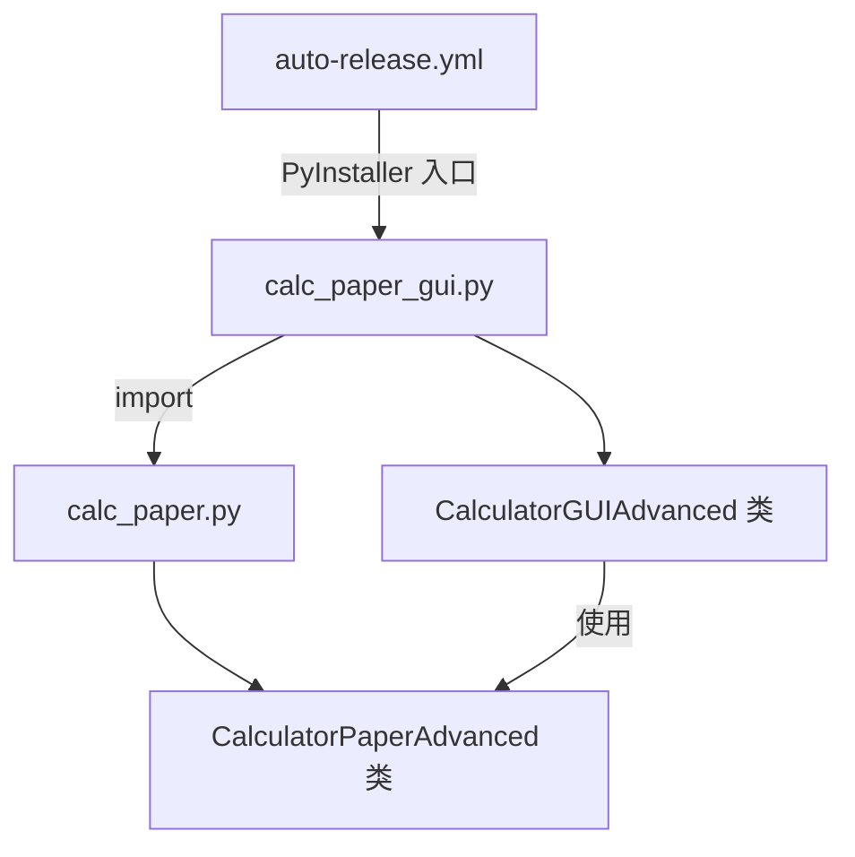
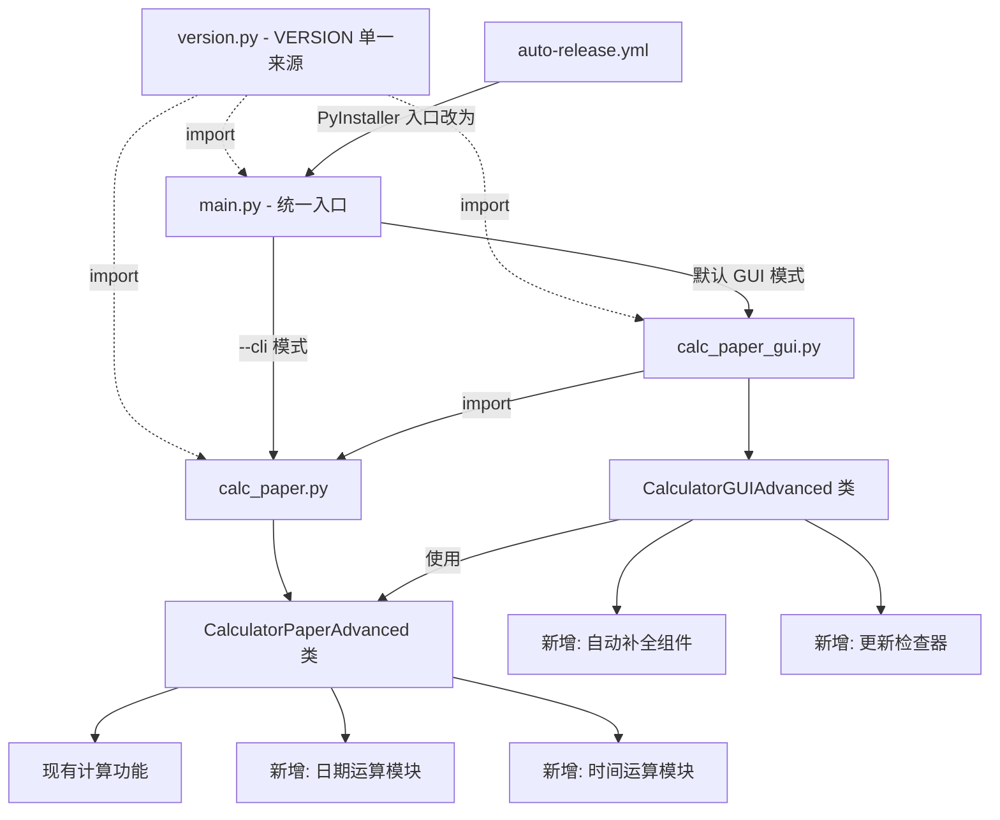

# 设计文档

## 概述

CalcPaper v2 功能包为现有的计算稿纸应用新增多项功能：变量名自动补全、日期加减运算、启动时后台检查更新、打包程序统一入口（GUI/CLI 双模式）、README 优化、GitHub Release 说明优化、知乎推广文档更新。

本设计基于现有架构：
- `calc_paper.py`：核心计算引擎 `CalculatorPaperAdvanced` 类 + CLI 交互式界面
- `calc_paper_gui.py`：基于 tkinter 的 GUI 界面，导入并使用核心引擎
- `.github/workflows/auto-release.yml`：GitHub Actions 自动发布工作流（PyInstaller 打包）

版本号从 1.4 升级到 2.0。版本号在 `version.py` 中统一定义，所有模块从该文件导入。

## 架构

### 现有架构



### v2 架构



### 关键设计决策

1. **日期运算集成在核心引擎中**：在 `CalculatorPaperAdvanced` 类中扩展 `parse_line()` 和 `evaluate()` 方法，使 GUI 和 CLI 都能使用日期运算，无需重复实现。

2. **时间运算集成在核心引擎中**：时间字面量（Thhmmss）之间的减法返回秒数差值；时间字面量与时间时长（h/m/s）的加减返回新的时间值。时间运算结果不跨天，溢出时报错。

3. **大小写区分体系**：日期时长使用大写前缀（M/W/D），时间时长使用小写前缀（h/m/s）。M 表示月份，m 表示分钟，两者通过大小写严格区分。

4. **版本号单一来源**：新建 `version.py` 文件，仅包含 `VERSION = "2.0"`。`calc_paper.py`、`calc_paper_gui.py`、`main.py` 均通过 `from version import VERSION` 导入，消除版本号重复定义。

5. **统一入口脚本 main.py**：新建 `main.py` 作为打包入口，通过 `argparse` 检测 `--cli` 参数决定启动模式。不带参数默认启动 GUI，带 `--cli` 启动 CLI。

6. **自动补全仅在 GUI 中实现**：自动补全是 GUI 交互功能，在 `CalculatorGUIAdvanced` 类中新增补全逻辑，通过解析输入区域文本获取已定义变量。

7. **更新检查器仅在 GUI 中实现**：使用 `threading` + `urllib.request` 在后台线程查询 GitHub API，通过 `root.after()` 回调在主线程显示提示。

8. **打包流程最小改动**：仅将 `auto-release.yml` 中 PyInstaller 入口从 `calc_paper_gui.py` 改为 `main.py`，其余打包配置不变。

9. **保留关键字**：Y、T、M、W、D、h、m、s 后跟数字的标识符为保留关键字，不可用作变量名。变量名验证正则需排除这些模式。


## 组件与接口

### 1. 日期运算模块（calc_paper.py 扩展）

在 `CalculatorPaperAdvanced` 类中扩展，新增日期/时间/时长字面量的解析和运算。

**新增内部方法：**

```python
class CalculatorPaperAdvanced:
    # 新增方法
    def _parse_date_literal(self, token: str) -> Optional[datetime.date]:
        """解析 Yyyyymmdd 格式的日期字面量，如 Y20260410 -> date(2026, 4, 10)"""
    
    def _parse_time_literal(self, token: str) -> Optional[datetime.time]:
        """解析 Thhmmss 格式的时间字面量，如 T143000 -> time(14, 30, 0)"""
    
    def _parse_duration_literal(self, token: str) -> Optional[dict]:
        """解析日期时长字面量 Mxx/Wxx/Dxx（大写），返回 {'type': 'months'|'weeks'|'days', 'value': int}"""
    
    def _parse_time_duration_literal(self, token: str) -> Optional[dict]:
        """解析时间时长字面量 hxx/mxx/sxx（小写），返回 {'type': 'hours'|'minutes'|'seconds', 'value': int}"""
    
    def _evaluate_date_expr(self, left, op: str, right):
        """计算日期表达式：日期+日期时长、日期-日期时长、日期-日期"""
    
    def _evaluate_time_expr(self, left, op: str, right):
        """计算时间表达式：时间+时间时长、时间-时间时长、时间-时间"""
    
    def _format_date_result(self, result) -> str:
        """将日期结果格式化为 Yyyyymmdd，时间结果格式化为 Thhmmss"""
    
    def _is_reserved_keyword(self, name: str) -> bool:
        """检查标识符是否为保留关键字（Y/T/M/W/D/h/m/s 后跟数字）"""
```

**解析流程变更：**

在 `parse_line()` 中，先检测表达式是否包含日期/时间/时长字面量（正则匹配 `Y\d{8}`、`T\d{6}`、`M\d+`、`W\d+`、`D\d+`、`h\d+`、`m\d+`、`s\d+`）。如果包含，走日期/时间运算分支；否则走现有数值运算分支。

**变量名验证：**

在变量赋值时，检查变量名是否与保留关键字冲突。保留关键字正则：`^[YTMWDhms]\d+$`。匹配此模式的标识符不可用作变量名，赋值时返回错误信息。

**日期运算规则：**

- `Y20260410 + D10` → `Y20260420`（日期 + 天数）
- `Y20260410 + M3` → `Y20260710`（日期 + 月数）
- `Y20260410 + W2` → `Y20260424`（日期 + 周数）
- `Y20260410 - Y20260101` → `99`（两日期相减返回天数差）
- `Y20260410 - D5` → `Y20260405`（日期 - 天数）
- 日期结果可赋值给变量，后续引用

**时间运算规则：**

- `T143000 - T120000` → `9000`（两时间相减返回秒数差值，整数）
- `T120000 + h2` → `T140000`（时间 + 小时）
- `T143000 + m30` → `T150000`（时间 + 分钟）
- `T120000 + s3600` → `T130000`（时间 + 秒）
- `T143000 - m30` → `T140000`（时间 - 分钟）
- 时间运算结果必须在 00:00:00 - 23:59:59 范围内，溢出时报错
- 时间结果可赋值给变量，后续引用

**大小写区分规则：**

- 大写 M/W/D：日期时长（月/周/天），只能与日期字面量（Y）运算
- 小写 h/m/s：时间时长（时/分/秒），只能与时间字面量（T）运算
- 混合运算（如 Y + h 或 T + M）返回错误信息

**月份加减的边界处理：**
- 使用 Python `datetime` 标准库
- 月份溢出时自动调整（如 1月31日 + M1 → 2月28日/29日）
- 使用 `calendar.monthrange()` 获取目标月份天数上限

### 2. 变量名自动补全组件（calc_paper_gui.py 扩展）

在 `CalculatorGUIAdvanced` 类中新增自动补全功能。

**新增类/方法：**

```python
class AutoCompletePopup:
    """自动补全弹窗组件"""
    def __init__(self, text_widget: tk.Text, root: tk.Tk):
        """绑定到指定的文本输入组件"""
    
    def show(self, candidates: list, x: int, y: int):
        """在指定位置显示候选列表"""
    
    def hide(self):
        """隐藏弹窗"""
    
    def select_current(self):
        """确认当前选中项"""
    
    def move_selection(self, direction: int):
        """上下移动选中项，direction: -1 上移, 1 下移"""

class CalculatorGUIAdvanced:
    # 新增方法
    def _get_defined_variables(self) -> list:
        """从输入区域文本中实时解析已定义的变量名"""
    
    def _get_current_prefix(self) -> tuple:
        """获取光标处正在输入的变量名前缀和起始位置"""
    
    def _on_key_for_autocomplete(self, event):
        """按键事件处理：触发补全、导航候选、确认选择"""
    
    def _update_autocomplete(self):
        """根据当前前缀更新候选列表"""
    
    def _insert_completion(self, variable_name: str, prefix_start: str):
        """将选中的变量名插入输入区域，替换已输入的前缀"""
```

**触发逻辑：**
- 用户每次按键后（`<KeyRelease>` 事件），提取光标处的前缀
- 前缀匹配已定义变量名（前缀匹配，不区分大小写）
- 有匹配项时显示弹窗，无匹配项时隐藏
- Tab/Enter 确认选择，Escape/点击外部关闭弹窗
- 上下方向键在候选列表中导航

**变量解析逻辑：**
- 扫描输入区域所有行，匹配 `变量名 = 表达式` 格式
- 使用正则 `^([a-zA-Z_\u4e00-\u9fa5][a-zA-Z0-9_\u4e00-\u9fa5]*)\s*=` 提取变量名
- 排除匹配保留关键字模式 `^[YTMWDhms]\d+$` 的标识符
- 实时解析，每次按键时重新扫描

### 3. 更新检查器（calc_paper_gui.py 扩展）

**新增类/方法：**

```python
class UpdateChecker:
    """后台更新检查器"""
    GITHUB_API_URL = "https://api.github.com/repos/matthewzu/CalcPaper/releases/latest"
    
    def __init__(self, current_version: str, language: str, callback):
        """
        current_version: 当前版本号，如 "2.0"
        language: 语言设置
        callback: 发现新版本时的回调函数 callback(new_version, download_url)
        """
    
    def check(self):
        """在后台线程中执行检查"""
    
    def _fetch_latest_version(self) -> tuple:
        """查询 GitHub API，返回 (version_str, download_url) 或 None"""
    
    def _compare_versions(self, current: str, remote: str) -> bool:
        """比较版本号，返回 remote 是否更新"""
```

**集成方式：**
- 在 `CalculatorGUIAdvanced.__init__()` 中，使用 `root.after(2000, ...)` 延迟启动检查（避免影响启动速度）
- 检查在 `threading.Thread(daemon=True)` 中执行
- 发现新版本后通过 `root.after(0, callback)` 回到主线程
- 在状态栏或弹出非模态提示框显示更新信息
- 网络错误静默忽略（`try/except` 包裹所有网络操作）
- 使用 `from version import VERSION` 获取当前版本号

**版本号比较逻辑：**
- 去除 `v` 前缀，按 `.` 分割为数字列表
- 逐段比较，如 `"2.0"` vs `"2.1"` → 需要更新

### 4. 版本号单一来源（version.py）

```python
"""CalcPaper 版本号 - 单一来源"""
VERSION = "2.0"
```

所有模块通过 `from version import VERSION` 导入版本号。现有 `calc_paper.py` 和 `calc_paper_gui.py` 中的 `VERSION = "1.4"` 行替换为 `from version import VERSION`。

### 5. 统一入口脚本（main.py）

```python
#!/usr/bin/env python3
"""CalcPaper 统一入口脚本"""
import sys
import argparse
from version import VERSION

def main():
    parser = argparse.ArgumentParser(description='CalcPaper - 计算稿纸')
    parser.add_argument('--cli', action='store_true', help='启动命令行模式')
    parser.add_argument('--lang', '-l', choices=['zh', 'en'], default=None, help='语言')
    parser.add_argument('--version', '-v', action='version', version=f'CalcPaper v{VERSION}')
    
    args = parser.parse_args()
    
    if args.cli:
        from calc_paper import main as cli_main
        # 重建 sys.argv 传递 --lang 参数给 CLI
        sys.argv = ['calc_paper']
        if args.lang:
            sys.argv.extend(['--lang', args.lang])
        cli_main()
    else:
        from calc_paper_gui import main as gui_main
        gui_main()

if __name__ == '__main__':
    main()
```

### 6. GitHub Actions 工作流变更（auto-release.yml）

仅修改 PyInstaller 入口点：

```yaml
# 变更前
pyinstaller --onefile --windowed --name=CalcPaper --icon=calcpaper.ico --add-data "calcpaper.ico;." calc_paper_gui.py

# 变更后
pyinstaller --onefile --windowed --name=CalcPaper --icon=calcpaper.ico --add-data "calcpaper.ico;." main.py
```

同时更新 Release 说明模板，加入 v2 新功能列表和 CLI 模式说明。PyInstaller 打包时需确保 `version.py` 被包含在内（作为 `main.py` 的依赖会自动包含）。

### 7. 文档更新（README、知乎推广文档）

**README 变更要点：**
- 版本号更新为 2.0
- 功能列表新增：日期运算、时间运算、变量补全、自动更新检查、CLI 打包
- 新功能标注 `🆕` 标记
- "下载打包程序"提升为首选使用方式
- 新增 CLI 模式使用说明：`CalcPaper.exe --cli`
- 新增保留关键字说明（Y/T/M/W/D/h/m/s 后跟数字不可用作变量名）

**知乎推广文档变更要点：**
- 版本号更新为 v2.0
- 功能列表新增 v2 功能
- 新增日期运算使用示例
- 对比表格新增日期运算、自动补全、自动更新行
- "下载打包程序"提升为首选
- 许可证修正为 GPL-3.0
- "未来规划"移除已实现项


## 数据模型

### 日期/时间内部表示

日期运算在核心引擎内部使用 Python 标准库类型：

```python
import datetime

# 日期值：datetime.date
# 时间值：datetime.time  
# 时长值：dict，如 {'type': 'days', 'value': 10}

# 变量存储扩展
# 现有 self.variables: dict[str, int|float]
# 扩展为 self.variables: dict[str, int|float|datetime.date|datetime.time]
```

**字面量格式：**

| 类型 | 格式 | 示例 | 内部表示 |
|------|------|------|----------|
| 日期 | `Yyyyymmdd` | `Y20260410` | `datetime.date(2026, 4, 10)` |
| 时间 | `Thhmmss` | `T143000` | `datetime.time(14, 30, 0)` |
| 月时长（大写） | `Mxx` | `M3` | `{'type': 'months', 'value': 3}` |
| 周时长（大写） | `Wxx` | `W2` | `{'type': 'weeks', 'value': 2}` |
| 天时长（大写） | `Dxx` | `D10` | `{'type': 'days', 'value': 10}` |
| 小时时长（小写） | `hxx` | `h2` | `{'type': 'hours', 'value': 2}` |
| 分钟时长（小写） | `mxx` | `m30` | `{'type': 'minutes', 'value': 30}` |
| 秒时长（小写） | `sxx` | `s45` | `{'type': 'seconds', 'value': 45}` |

**运算结果类型：**

| 运算 | 结果类型 | 格式化输出 |
|------|----------|-----------|
| 日期 + 日期时长（M/W/D） | `datetime.date` | `Yyyyymmdd` |
| 日期 - 日期时长（M/W/D） | `datetime.date` | `Yyyyymmdd` |
| 日期 - 日期 | `int`（天数） | 十进制数字 |
| 时间 - 时间 | `int`（秒数） | 十进制数字 |
| 时间 + 时间时长（h/m/s） | `datetime.time` | `Thhmmss` |
| 时间 - 时间时长（h/m/s） | `datetime.time` | `Thhmmss` |

### 自动补全候选数据

```python
# 候选项结构
candidate = {
    'name': str,      # 变量名
    'value': str,     # 变量当前值的字符串表示（用于提示）
}
```

### 更新检查 API 响应

GitHub Releases API 响应（仅使用的字段）：

```json
{
    "tag_name": "v2.0",
    "html_url": "https://github.com/matthewzu/CalcPaper/releases/tag/v2.0"
}
```

### 版本号管理

版本号在 `version.py` 中统一定义为单一来源：

```python
# version.py
VERSION = "2.0"
```

`calc_paper.py`、`calc_paper_gui.py`、`main.py` 均通过 `from version import VERSION` 导入。现有文件中的 `VERSION = "1.4"` 行替换为导入语句。更新检查器使用同一个 VERSION 常量。

**保留关键字列表：**

以下前缀后跟数字的标识符为系统保留关键字，不可用作变量名：

| 前缀 | 含义 | 示例 |
|------|------|------|
| `Y` | 日期字面量 | `Y20260410` |
| `T` | 时间字面量 | `T143000` |
| `M` | 月时长（大写） | `M3` |
| `W` | 周时长（大写） | `W2` |
| `D` | 天时长（大写） | `D10` |
| `h` | 小时时长（小写） | `h2` |
| `m` | 分钟时长（小写） | `m30` |
| `s` | 秒时长（小写） | `s45` |

变量名验证正则排除模式：`^[YTMWDhms]\d+$`


## 正确性属性

*属性（Property）是指在系统所有合法执行中都应成立的特征或行为——本质上是对系统应做什么的形式化陈述。属性是人类可读规格说明与机器可验证正确性保证之间的桥梁。*

### Property 1: 自动补全前缀过滤

*For any* 已定义变量名列表和任意非空前缀字符串，自动补全过滤函数返回的所有候选项都应以该前缀开头，且不应遗漏任何匹配的变量名。

**Validates: Requirements 1.1**

### Property 2: 自动补全文本插入

*For any* 输入文本、光标位置、已输入前缀和选中的变量名，执行插入操作后，前缀部分应被完整替换为选中的变量名，且文本的其余部分保持不变。

**Validates: Requirements 1.2**

### Property 3: 变量名解析

*For any* 包含若干 `变量名 = 表达式` 格式行的输入文本，变量名解析函数提取的变量名集合应与文本中实际定义的变量名集合完全一致。

**Validates: Requirements 1.5**

### Property 4: 日期/时间字面量往返一致性

*For any* 合法的日期值（datetime.date）或时间值（datetime.time），将其格式化为 Yyyyymmdd / Thhmmss 字符串后再解析回来，应得到与原始值相等的对象。

**Validates: Requirements 2.1, 2.2, 2.19**

### Property 5: 时长字面量解析

*For any* 正整数 n 和时长类型（日期时长 M/W/D 或时间时长 h/m/s），将其格式化为对应的字面量字符串（如 `M3`、`W2`、`D10`、`h2`、`m30`、`s45`）后解析，应得到类型和数值均正确的时长对象。

**Validates: Requirements 2.3, 2.4, 2.5, 2.6, 2.7, 2.8**

### Property 6: 日期运算正确性

*For any* 合法日期和日期时长（天/周/月，大写 M/W/D），日期加减运算的结果应与 Python datetime 标准库直接计算的结果一致；*For any* 两个合法日期，相减的结果应等于两日期之间的天数差值。

**Validates: Requirements 2.9, 2.10, 2.11**

### Property 7: 日期运算往返一致性

*For any* 合法的日期字面量 d 和时长字面量 p，`parse(format(parse(d) + parse(p)))` 应产生与 `parse(d) + parse(p)` 等价的结果。即日期运算结果经过格式化再解析后不丢失信息。

**Validates: Requirements 2.20**

### Property 8: 时间运算正确性

*For any* 合法时间和时间时长（小时/分钟/秒，小写 h/m/s），在结果不溢出 00:00:00-23:59:59 范围的前提下，时间加减运算的结果应与 Python timedelta 直接计算的结果一致；*For any* 两个合法时间，相减的结果应等于两时间之间的秒数差值。

**Validates: Requirements 2.12, 2.13, 2.14**

### Property 9: 大小写区分

*For any* 正整数 n，解析大写 `M{n}` 应得到类型为 'months' 的日期时长，解析小写 `m{n}` 应得到类型为 'minutes' 的时间时长，两者类型不同。同理，大写 D/W 与小写 h/s 各自解析为对应的独立类型。

**Validates: Requirements 2.21**

### Property 10: 保留关键字排除

*For any* 匹配模式 `^[YTMWDhms]\d+$` 的字符串，变量名验证函数应拒绝其作为合法变量名。

**Validates: Requirements 2.22**

### Property 11: 版本号比较

*For any* 两个合法版本号字符串（格式为 `x.y` 或 `vx.y`），版本比较函数应正确判断哪个版本更新：当且仅当远程版本的数字序列在字典序上大于当前版本时，返回"需要更新"。

**Validates: Requirements 3.2**


## 错误处理

### 日期运算错误

| 错误场景 | 处理方式 |
|----------|----------|
| 日期格式不合法（如 `Y20261301`，月份13） | 返回错误信息："日期格式错误: 月份必须在1-12之间" / "Invalid date: month must be 1-12" |
| 日期不存在（如 `Y20260230`，2月30日） | 返回错误信息："日期不存在" / "Invalid date" |
| 不支持的运算（如日期 + 日期） | 返回错误信息："不支持的日期运算" / "Unsupported date operation" |
| 时长值为负数或零 | 返回错误信息："时长必须为正整数" / "Duration must be a positive integer" |
| 日期字面量与数值混合运算 | 返回错误信息："日期不能与数值直接运算" / "Cannot mix date and numeric operations" |
| 时间运算结果溢出（如 `T230000 + h3`） | 返回错误信息："时间溢出：结果超出一天范围" / "Time overflow: result exceeds 24-hour range" |
| 日期时长与时间混合运算（如 `T120000 + M3`） | 返回错误信息："日期时长不能与时间运算" / "Cannot use date duration with time" |
| 时间时长与日期混合运算（如 `Y20260410 + h2`） | 返回错误信息："时间时长不能与日期运算" / "Cannot use time duration with date" |
| 变量名为保留关键字（如 `M3 = 100`） | 返回错误信息："变量名与保留关键字冲突" / "Variable name conflicts with reserved keyword" |

### 自动补全错误

| 错误场景 | 处理方式 |
|----------|----------|
| 输入区域为空 | 不显示补全弹窗 |
| 光标在注释行中 | 不触发补全 |
| 弹窗创建失败（tkinter 异常） | 静默忽略，不影响正常输入 |

### 更新检查错误

| 错误场景 | 处理方式 |
|----------|----------|
| 网络不可用 | 静默忽略，`try/except` 捕获所有异常 |
| API 返回非 200 状态码 | 静默忽略 |
| JSON 解析失败 | 静默忽略 |
| 版本号格式异常 | 静默忽略，不显示更新提示 |
| 超时（设置 5 秒超时） | 静默忽略 |

### 入口脚本错误

| 错误场景 | 处理方式 |
|----------|----------|
| 未知命令行参数 | argparse 自动显示帮助信息并退出 |
| GUI 模式下 tkinter 不可用 | 捕获 ImportError，提示用户使用 `--cli` 模式 |

## 测试策略

### 测试框架

- **单元测试**：`unittest`（Python 标准库）
- **属性测试**：`hypothesis`（Python 属性测试库）
- 每个属性测试配置最少 100 次迭代

### 属性测试

每个正确性属性对应一个属性测试，使用 `hypothesis` 库的 `@given` 装饰器生成随机输入。

| 属性 | 测试文件 | 生成器策略 |
|------|----------|-----------|
| Property 1: 自动补全前缀过滤 | `test_autocomplete.py` | 生成随机变量名列表 + 随机前缀 |
| Property 2: 自动补全文本插入 | `test_autocomplete.py` | 生成随机文本 + 随机光标位置 + 随机变量名 |
| Property 3: 变量名解析 | `test_autocomplete.py` | 生成包含随机赋值行的文本 |
| Property 4: 日期/时间字面量往返 | `test_date_calc.py` | `hypothesis.strategies.dates()` + `hypothesis.strategies.times()` |
| Property 5: 时长字面量解析 | `test_date_calc.py` | 生成随机正整数 + 随机类型选择（M/W/D/h/m/s） |
| Property 6: 日期运算正确性 | `test_date_calc.py` | 生成随机日期 + 随机日期时长（M/W/D） |
| Property 7: 日期运算往返一致性 | `test_date_calc.py` | 生成随机日期字面量 + 随机时长字面量 |
| Property 8: 时间运算正确性 | `test_date_calc.py` | 生成随机时间 + 随机时间时长（h/m/s），过滤溢出情况 |
| Property 9: 大小写区分 | `test_date_calc.py` | 生成随机正整数，分别构造大写和小写字面量 |
| Property 10: 保留关键字排除 | `test_date_calc.py` | 生成匹配 `^[YTMWDhms]\d+$` 模式的随机字符串 |
| Property 11: 版本号比较 | `test_update_checker.py` | 生成随机版本号对 |

每个测试必须包含注释标签，格式为：
```python
# Feature: v2-feature-pack, Property 1: 自动补全前缀过滤
```

### 单元测试

单元测试覆盖具体示例和边界情况：

| 测试范围 | 测试文件 | 测试内容 |
|----------|----------|----------|
| 日期解析边界 | `test_date_calc.py` | 非法日期（月份>12、日期>31）、闰年2月29日、月末边界 |
| 日期运算边界 | `test_date_calc.py` | 1月31日+M1→2月28日、跨年运算、日期相减为负数 |
| 时间运算边界 | `test_date_calc.py` | T230000+h3 溢出报错、T000000-s1 溢出报错、T143000-T120000=9000 |
| 时间时长解析 | `test_date_calc.py` | h0/m0/s0 边界、大数值如 h23/m59/s59 |
| 大小写区分 | `test_date_calc.py` | M3 解析为月、m3 解析为分钟、混合运算报错 |
| 保留关键字 | `test_date_calc.py` | M3/h2/T120000 等不可用作变量名、abc123 可用 |
| 自动补全 | `test_autocomplete.py` | 空输入、中文变量名、特殊字符 |
| 更新检查 | `test_update_checker.py` | 网络超时模拟、JSON 格式异常、版本号格式异常 |
| 入口脚本 | `test_main.py` | `--cli` 参数、`--lang zh`、无参数默认 GUI、`--version` |
| 版本号来源 | `test_main.py` | 验证 version.py 中 VERSION 可被正确导入 |
| 文档内容 | 手动验证 | README 结构、Release 说明、知乎文档内容 |

### 测试执行

```bash
# 安装测试依赖
pip install hypothesis

# 运行所有测试
python -m pytest test_date_calc.py test_autocomplete.py test_update_checker.py test_main.py -v

# 单独运行属性测试
python -m pytest test_date_calc.py -v -k "property"
```

